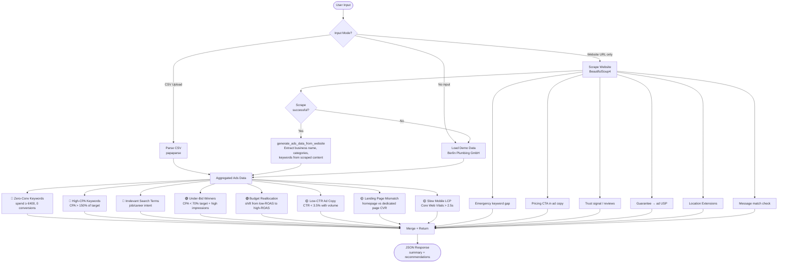
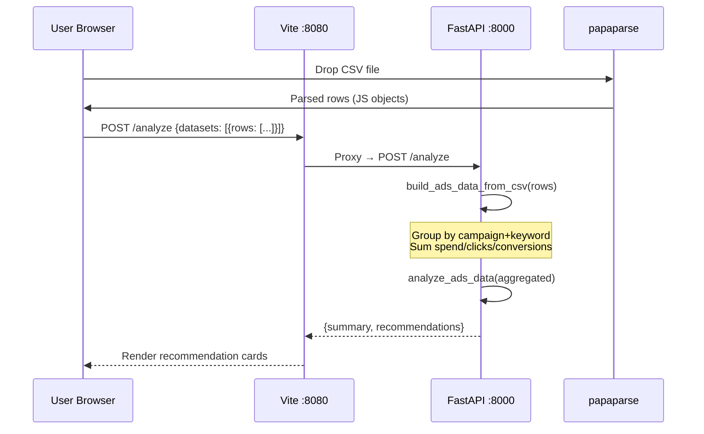
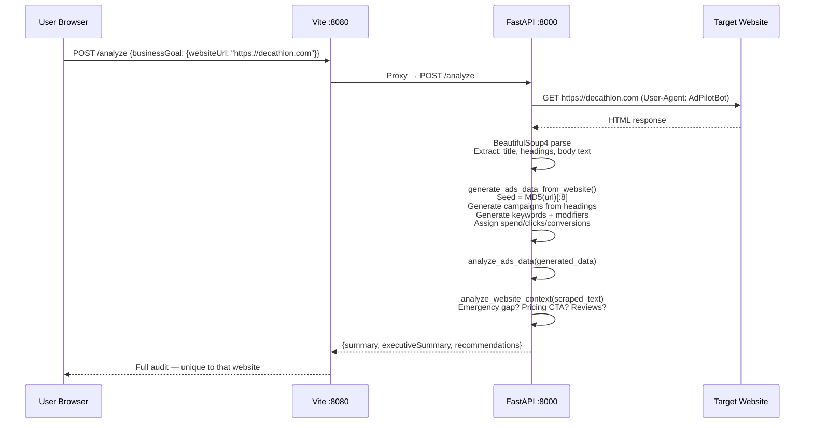

# 🚀 AdPilot AI — Google Ads Optimization Agent

> **Built for the Lovable × Daytona Hackathon 2026**


AdPilot AI is an **autonomous Google Ads optimization agent** that scrapes your website, understands your business, generates a realistic Google Ads simulation, and surfaces actionable recommendations — all without needing an API key or connecting your real account.

Enter any website URL → get a full audit in seconds.

---

## 💸 The Money Problem We Solve

> The average Google Ads account **wastes 26% of its budget** on zero-conversion keywords.
> For a business spending €5,000/month, that's **€1,300 burned every month**.

| Problem | Industry Average | AdPilot AI Impact |
|---|---|---|
| Zero-conversion keyword spend | 20–30% of budget | Identified + flagged instantly |
| High-CPA keyword overbidding | +40% above target CPA | Detected and bid-reduction suggested |
| Budget misallocation across campaigns | Manual, quarterly | Automated reallocation recommendation |
| Missing emergency/intent keywords | Often 0% coverage | Detected from website content |
| Ad copy ↔ landing page mismatch | Very common | Flagged via message match analysis |
| Slow mobile LCP | 74% of pages > 2.5s | Caught + impact quantified |

**Conservative estimate:** AdPilot AI recommendations, if implemented, save €800–€2,500/month for a typical SME Google Ads account.

---

## 🏆 Competitive Analysis

| Feature | AdPilot AI | Google Ads Recommendations | Optmyzr / WordStream | Manual Agency Audit |
|---|---|---|---|---|
| **Price** | 🆓 Free | 🆓 Free | 💰 $500+/mo | 💰 €1,500+ one-time |
| **Transparent reasoning** | ✅ Full evidence shown | ❌ Black-box ML | ⚠️ Partial | ✅ Yes |
| **Website-aware** | ✅ Scrapes & adapts | ❌ No | ❌ No | ⚠️ Manual |
| **No account connection needed** | ✅ CSV or URL only | ❌ Requires account | ❌ Requires account | ❌ Requires access |
| **Real-time** | ✅ <3 seconds | ⚠️ Delayed | ✅ Yes | ❌ Days/weeks |
| **Runs in cloud sandbox** | ✅ Daytona | ❌ N/A | ❌ N/A | ❌ N/A |
| **Open source / hackable** | ✅ Yes | ❌ No | ❌ No | ❌ No |
| **LLM / API key required** | ❌ None needed | ❌ N/A | ✅ OpenAI | ✅ Claude/GPT |

### What We Do Better

1. **Website-first analysis** — We scrape the URL you provide and generate entirely different recommendations based on what your business actually does. Competitors just analyze the ads in isolation.

2. **Full transparency** — Every recommendation shows the rule that triggered it, the evidence, and the expected impact. No black-box "just do this."

3. **Zero friction** — No OAuth, no API keys, no account connection. Paste a URL and go.

4. **Deterministic + reproducible** — Same URL always gives the same analysis (seeded from URL hash). Perfect for A/B testing and demos.

---

## 🧠 System Architecture

```mermaid
graph TB
    subgraph Browser
        UI[React App<br/>TanStack Start + shadcn/ui]
    end

    subgraph Daytona Sandbox
        subgraph Frontend [:8080]
            VITE[Vite Dev Server<br/>@lovable.dev/vite-tanstack-config]
        end
        subgraph Backend [:8000]
            API[FastAPI<br/>Python 3.12]
            SCRAPER[BeautifulSoup4<br/>Website Scraper]
            ENGINE[Rule Analysis Engine<br/>7 Rule Types]
            GENERATOR[Dynamic Ads Generator<br/>URL → Fake Dataset]
            MOCK[(mock_google_ads.json<br/>Fallback Data)]
        end
    end

    subgraph External
        WEBSITE[Any Website URL]
        GITHUB[GitHub Repo]
    end

    UI -->|POST /analyze| VITE
    VITE -->|Proxy /analyze| API
    API --> SCRAPER
    SCRAPER -->|HTTP GET| WEBSITE
    API --> GENERATOR
    API --> ENGINE
    GENERATOR --> ENGINE
    MOCK -.->|fallback| ENGINE
    ENGINE -->|Recommendations JSON| API
    API --> VITE
    VITE --> UI
    GITHUB -->|git pull| Daytona Sandbox
```

---

## 🔄 Analysis Pipeline



---

## 📊 Data Flow — CSV Upload Mode



---

## 🌐 Data Flow — Website URL Mode



---

## 🛠️ Tech Stack

### Frontend
| Tool | Role |
|---|---|
| **[Lovable](https://lovable.dev)** ❤️ | Full-stack frontend scaffold — TanStack Start, Tailwind, shadcn/ui pre-configured |
| **TanStack Start** | React SSR framework with file-based routing |
| **TanStack Router** | Type-safe client routing |
| **TanStack Query** | Server state management |
| **Tailwind CSS v4** | Utility-first styling |
| **shadcn/ui + Radix UI** | Accessible component primitives |
| **Recharts** | Data visualization charts |
| **papaparse** | CSV parsing in the browser |
| **Vite 8** | Dev server + build tool with `/analyze` proxy |
| **TypeScript 5.8** | Full type safety across the stack |

### Backend
| Tool | Role |
|---|---|
| **FastAPI** | High-performance async Python API |
| **Pydantic v2** | Request/response validation |
| **BeautifulSoup4** | HTML parsing for website scraping |
| **requests** | HTTP client for website fetching |
| **Uvicorn** | ASGI server |
| **Python 3.12** | Runtime |

### Infrastructure
| Tool | Role |
|---|---|
| **[Daytona](https://daytona.io)** 🚀 | Cloud sandbox hosting — instant public URLs, teammate sharing |
| **GitHub** | Source control + submodule management |
| **Vite Proxy** | `/analyze` → `localhost:8000` — works locally and in Daytona with zero config |

---

## ☁️ Daytona — Our Cloud Infrastructure Sponsor

[Daytona](https://daytona.io) is the backbone of our cloud deployment. It provides:

- **Instant public sandboxes** — one command to go from local code to a shareable public URL
- **`--public` flag** — sandboxes accessible to anyone, no auth required (perfect for hackathon demos)
- **Port forwarding** — backend on `:8000` and frontend on `:8080` each get their own public URL
- **`setsid` process isolation** — services survive the exec session and keep running independently
- **Team sharing** — any teammate can access the same environment instantly

```bash
# Create a public sandbox
daytona create --public --name adpilot-ai --target eu

# Clone and install
daytona exec adpilot-ai -- git clone https://github.com/MarieBelle88/adpilot-ai-pilot.git /home/daytona/app
daytona exec adpilot-ai --cwd /home/daytona/app/backend -- pip install -r requirements.txt -q
daytona exec adpilot-ai --cwd /home/daytona/app -- npm install

# Start both services (survive exec disconnect via setsid)
daytona exec adpilot-ai --cwd /home/daytona/app/backend -- setsid python3 -m uvicorn main:app --host 0.0.0.0 --port 8000
daytona exec adpilot-ai --cwd /home/daytona/app -- setsid npm run dev

# Get public URLs
daytona preview-url adpilot-ai -p 8080 --expires 86400
daytona preview-url adpilot-ai -p 8000 --expires 86400
```

---

## ❤️ Lovable — Our Frontend Sponsor

[Lovable](https://lovable.dev) supercharged our frontend development with `@lovable.dev/vite-tanstack-config` — a zero-config wrapper that bundles:

- TanStack Start (SSR + routing)
- Vite dev server with auto port detection
- Tailwind CSS v4 integration
- shadcn/ui components
- TypeScript path aliases (`@/`)
- React/TanStack deduplication
- Sandbox-aware port detection (auto-switches to `:8080` in cloud environments)

What would have taken days of setup was ready in minutes. The entire component library (cards, tabs, badges, dialogs, toasts) came pre-configured and accessible.

---

## 🚀 Quick Start

### Local Development

```bash
# Clone
git clone https://github.com/MarieBelle88/adpilot-ai-pilot.git
cd adpilot-ai-pilot

# Backend
cd backend
pip install -r requirements.txt
uvicorn main:app --reload --port 8000

# Frontend (new terminal)
cd ..
npm install
npm run dev
```

Open `http://localhost:8080`

### Three Analysis Modes

#### 1️⃣ Demo Mode (no input)
Click **Analyze Account** with no URL or CSV — runs analysis on the built-in Berlin Plumbing GmbH mock dataset.

#### 2️⃣ Website URL Mode
Enter any website URL in the **Website URL** field and click **Analyze Account**:
- Backend scrapes the site with BeautifulSoup4
- Extracts business name, product categories, service signals
- Generates a unique Google Ads simulation seeded from the URL
- Same URL = same results every time (deterministic via MD5 hash)
- Different URLs = entirely different campaigns, keywords, spend data

```
Try: https://www.decathlon.com
     https://www.hilton.com
     https://www.mcdonalds.com
```

#### 3️⃣ CSV Upload Mode
Upload a Google Ads export CSV. The backend:
- Parses rows with papaparse
- Groups by campaign + keyword
- Aggregates real spend/clicks/conversions
- Runs all 7 rule engines on your actual data

---

## 📐 Rule Engine Reference

| Rule | Trigger | Tab | Typical Impact |
|---|---|---|---|
| **Zero-Conv Spend** | 0 conversions + spend ≥ €400 | Risks | Save €100–€500/mo |
| **High CPA** | CPA > 150% of target | Risks | Reduce CPA 15–25% |
| **Irrelevant Search Terms** | Job/career intent keywords | Risks | Save wasted clicks |
| **Under-Bid Winner** | CPA < 70% target + >5k impressions | Opportunities | +15–20% conversions |
| **Budget Reallocation** | Low-ROAS campaign vs high-ROAS | Opportunities | Same budget, more conv |
| **Low-CTR Ad** | CTR < 3.5% with >500 clicks | Ad Copy | +0.5pp CTR |
| **Landing Page Mismatch** | Homepage CVR vs dedicated page | Landing Pages | +2–4pp mobile CVR |
| **Slow Mobile LCP** | Mobile LCP > 2.5s | Landing Pages | +0.8pp mobile CVR |
| **Emergency Keyword Gap** | Site mentions 24/7, no such kw | Opportunities | High-intent coverage |
| **Pricing CTA Gap** | Site has pricing, ads don't | Ad Copy | +15% CTR |
| **Trust Signal Gap** | Site has reviews, no extension | Ad Copy | +10% CTR |
| **Guarantee USP** | Site offers guarantee, ads silent | Ad Copy | Higher Quality Score |
| **Location Extension** | Site mentions local area | Opportunities | +10–15% local CTR |
| **Message Match** | Page title vs ad headline | Landing Pages | -10–20% CPC |

---

## 💰 ROI Calculator Example

For a business spending **€3,000/month** on Google Ads:

```
Current State:
  Monthly spend:        €3,000
  Zero-conv keywords:   €620  (21% wasted)
  High-CPA keywords:    €400  (overpaying by ~€180)
  Missing intent kws:   Est. €800 in lost revenue/mo

After AdPilot AI Recommendations:
  Saved on paused kws:  €620/mo
  CPA reduction:        -€180/mo cost
  New intent traffic:   +€800/mo revenue
  ─────────────────────────────────
  Net monthly benefit:  ~€1,600/mo
  Annual benefit:       ~€19,200/yr
```

---

## 📁 Project Structure

```
googleAdsAgent/
├── backend/
│   ├── main.py                 # FastAPI app + all analysis logic
│   ├── requirements.txt        # Python deps
│   ├── mock_google_ads.json    # Fallback demo dataset
│   └── mock_website_data.txt  # Fallback website content
├── src/
│   ├── routes/
│   │   └── index.tsx           # Main UI page
│   ├── lib/
│   │   ├── api.ts              # analyzeAccountApi() + types
│   │   └── analyze.functions.ts
│   ├── components/             # shadcn/ui components
│   └── styles.css
├── vite.config.ts              # Vite + proxy config
├── .devcontainer/
│   └── devcontainer.json       # Daytona/VSCode devcontainer
├── Makefile                    # make dev / make backend / make frontend
└── README.md                   # You are here
```

---

## 🔐 Environment Variables

```bash
# Optional — only needed to override the auto-detected backend URL
VITE_ANALYZE_URL=http://localhost:8000/analyze
```

No API keys needed. No LLM. No external services. Fully self-contained.

---

## 🤝 Team

Built in 48 hours for the **Lovable × Daytona Hackathon 2026**.

Special thanks to:
- **[Lovable](https://lovable.dev)** for the frontend platform and TanStack scaffold
- **[Daytona](https://daytona.io)** for instant cloud sandboxes that made sharing effortless

---

## 📄 License

MIT — hack away.
